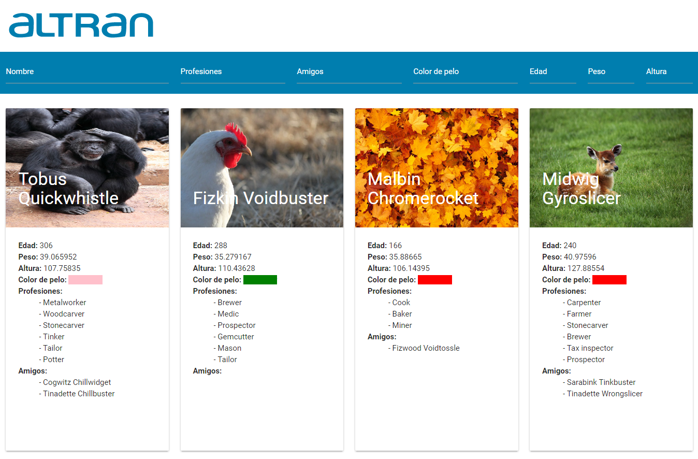

# Altran Front - technical test 

## Altran frontend technical test


## Technologies
> - Node JS Version 8.7.0
> - Angular Js Version 1.6.6
> - ECMAScript 6, 7
> - TypeScript 2
> - Materialize css

## Libraries
### Develop
> - **angular-mocks:** This package is for test in karma with jasmine, charge modules and use funcionalities of angularJS.
> - **babel and plugins for typescript:** This libraries transpiling TypeScript files and create pollifiles for compatiblity of differents browsers.
> - **Eslint and plugins:** javascript linter for guidelines bests practices for developers.
> - **gulp and plugins:** Task manager for developers, for example: tasks for transpiling javascript, sass, also for start the node server.
> - **karma and jasmin:** Testing tools.
> - **tsify, typescript:** Dependencies for write and transpiling TypeScript code.
> - **tslint:**  TypeScript linter for guidelines bests practices for developers.
> - **vinyl-buffer:** Generator helper for create source maps.
> - **yargs:** A dynamically generated help menu based on your arguments.

### Production
> - **@types/angular:** TypeScript definitions for Angular.
> - **angular:** Client-side JavaScript Framework.
> - **body-parser:** Parser for HTTP request.
> - **express:** Framework for Node.js, used in this project for server and Backend of frontend.
> - **morgan:** Prettyfier console log for express.
> - **pug:** javascript based template engine for Node.js.
> - **request:** Dependency for HTTP request.
> - **request-promise:** Transform resquest function in a promise.
> - **materialize:** Framework of styles and javascript components.
> - **JQuery:** Javascript library for handling the DOM.
> - **ng-infinite-scroll:** Progressive scrolling helpper.

## Global dependecies
> - gulp

## Install
```
$ npm install
```
## Build 
```
$ npm run build
```

## Run 
```
$ npm start
```

## Test
> before run app
```
$ npm run test
```

## Instalation
```
$ npm install
```

## Run
```
gulp
```